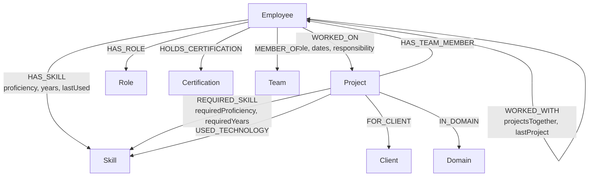
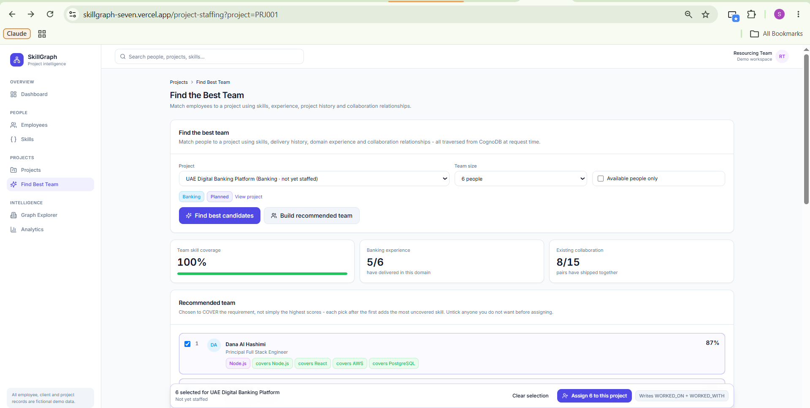
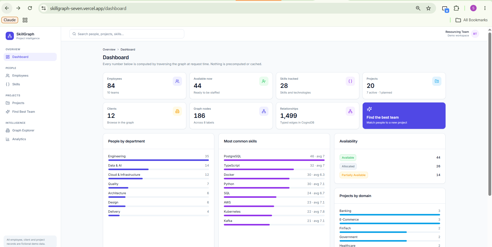
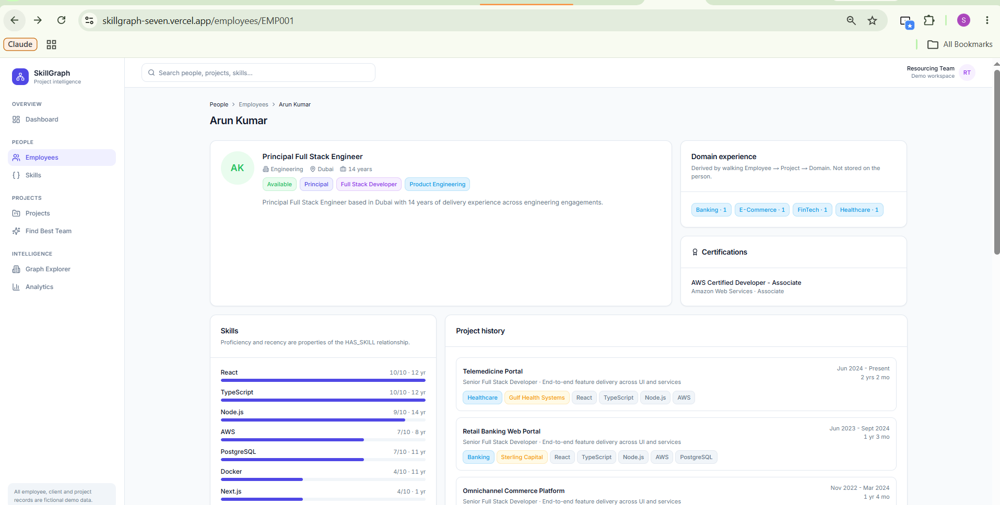
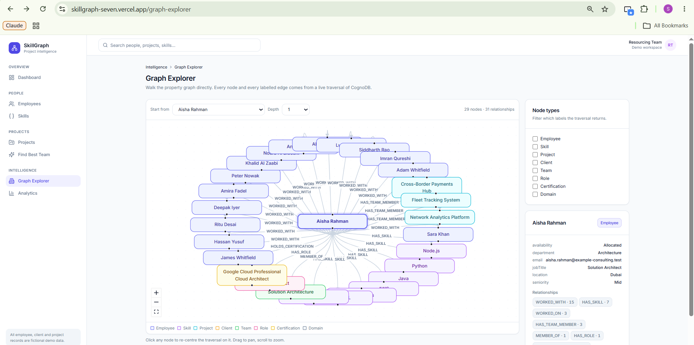
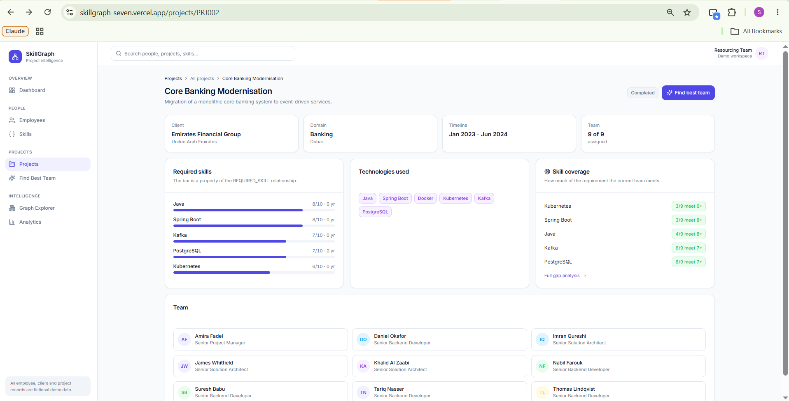
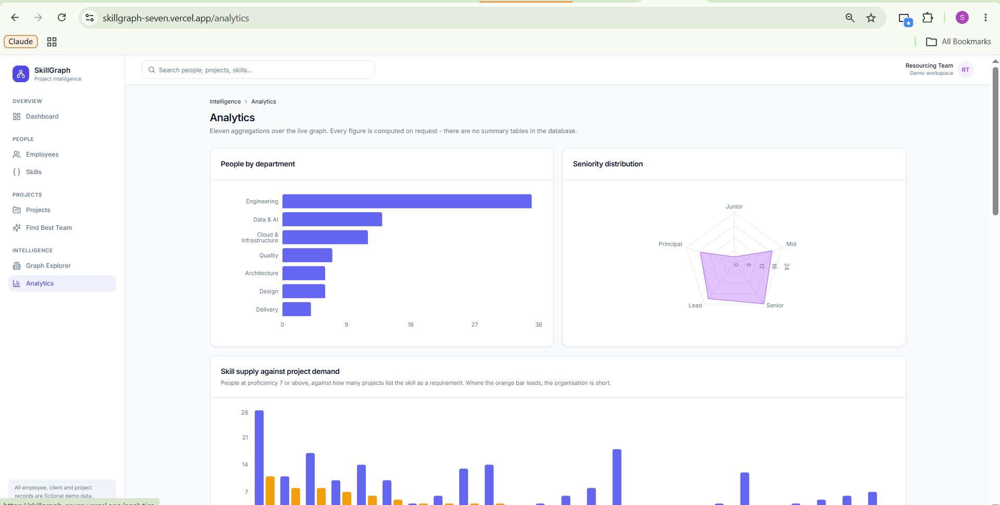

# SkillGraph

**Find the right people for the right projects.**

Explore employee expertise, project experience and collaboration networks using
graph intelligence.

A CognoDB take-home assignment: a functional web application built on a graph
database, where the relationships between people, skills, projects and clients
are the data — not something reconstructed at query time from foreign keys.

| | |
|---|---|
| **Stack** | Next.js 14.1.4 · React 18.2.0 · TypeScript (strict) · Tailwind CSS |
| **Database** | CognoDB Cloud, over the official `neo4j-driver` (Bolt) |
| **Graph** | 186 nodes · 1,499 relationships · 8 node labels · 9 relationship types |
| **Live demo** | **https://skillgraph-seven.vercel.app** |
| **Repository** | https://github.com/sajith-sk-18/skillgraph |
| **Screen recording** | `TODO: paste the recording link here` |

> The fastest way to see the point of this application:
> **[open the staffing engine on the unstaffed banking project](https://skillgraph-seven.vercel.app/project-staffing?project=PRJ001)**
> and press *Build recommended team*.

> **All employee, client, project and skill records in this application are
> fictional demo data.** They are generated by `scripts/seed-data.ts` for
> demonstration purposes and do not describe real people or organisations.

---

## 1. The problem

A consultancy wins a new contract — a digital banking platform needing React,
Node.js, Python, AWS and PostgreSQL. Somewhere among 84 people, the right team
exists. Conventional HR software answers:

> *Who has "React" on their profile?*

That question is nearly useless. It returns everyone who ticked a box, ranked by
nothing. The question a resourcing manager actually needs answered is:

> *Who has these skills, **and** has shipped something in banking before,
> **and** has already worked alongside the other people I am about to put on
> this team?*

That last clause matters more than it looks. Five strangers who each look
perfect on paper routinely underperform five people who have shipped together.

SkillGraph answers the real question by modelling the organisation as a graph
and walking it.

---

## 2. Features

**Staffing intelligence** — the point of the application

- **Find the best candidates** — every person scored 0–100 against a project,
  with all five score components shown, never a bare number
- **Build a recommended team** — a *different* algorithm: greedy set cover over
  the required skills, not the top N individuals
- **Team compatibility** — every pair in the proposed team, with how many
  projects they have actually shipped together
- **Skill gap analysis** — per requirement: who on the team meets the bar, and
  who outside it could close the shortfall
- **Assign the team** — commit a staffing decision back to the graph, writing
  real delivery history and updating the derived collaboration edge with it

**Directory and records**

- Employee directory with seven filters, all executed as Cypher
- Employee profile: skills with proficiency, full project history, co-workers,
  certifications, derived domain experience
- Project directory and detail, with required skills, technologies and team
- Skill catalogue with holders, projects, average proficiency and co-occurrence
- Project creation, including **adding a client or a domain that does not exist
  yet**, writing new nodes and relationships to CognoDB

**Graph and analytics**

- Interactive graph explorer — pick any entity, traverse 1–3 hops, filter by
  node label, click to re-centre
- Employee network view embedded in each profile
- Analytics: eleven live aggregations including skill supply vs. project demand
- Global search across employees, projects, skills, clients and teams

**Throughout**: skeleton loading states, empty states with a way forward,
friendly error states, full keyboard access, responsive from 375px up.

---

## 3. Why a graph database?

The honest answer is **not** "SQL cannot do this". SQL can. The argument is
about whether the query still resembles the question, and about what happens as
the number of hops grows.

### Relationships are first-class

The interesting facts in this domain live *on the relationship*, not on either
node:

```cypher
(Employee)-[:HAS_SKILL { proficiency: 9, years: 4, lastUsed: "2026-02-01" }]->(Skill)
(Employee)-[:WORKED_ON { role: "Senior Frontend Developer", startDate: "2024-01-01" }]->(Project)
(Employee)-[:WORKED_WITH { projectsTogether: 3, lastProject: "PRJ005" }]->(Employee)
(Project)-[:REQUIRED_SKILL { requiredProficiency: 8, requiredYears: 3 }]->(Skill)
```

"Sara knows Python" is almost worthless. "Sara has used Python at 9/10 for six
years, most recently last month" is what the staffing algorithm scores. A
`Skill` node is shared by 84 people and cannot carry any one person's
proficiency — the relationship is the only correct home for it.

### One traversal crosses five relationship types

The staffing query walks skill matching, delivery history, domain experience and
collaboration in a single continuous pattern. In a relational schema each of
those hops is a **different table** — `employee_skills`, `project_assignments`,
`projects`, `domains`, and a collaboration set that itself has to be derived by
self-joining `project_assignments`.

### Derived relationships that would otherwise be a nightly job

`WORKED_WITH` is not authored anywhere. It is computed from genuine project
overlap when the graph is seeded, and it makes "who has this person shipped
with?" a single hop instead of a self-join over the assignment table grouped
twice. `scripts/verify-queries.ts` asserts both directions of that equivalence:
333 collaboration edges, 333 project-sharing pairs.

### Concrete example — the demo scenario

```
Dana Al Hashimi -HAS_SKILL{9}-> React <-REQUIRED_SKILL{8}- UAE Digital Banking Platform
       |
  WORKED_ON
       v
Core Banking Modernisation -IN_DOMAIN-> Banking
       |
  WORKED_WITH{3}
       v
   Arun Kumar  (also a strong candidate for the same project)
```

Every clause of "qualified, domain-experienced, and connected to other
qualified people" is one continuous walk.

---

## 4. Architecture

```
Browser
   |
   v
Next.js 14.1 App Router
   |
   +---------------------------+
   |                           |
   v                           v
UI Components            Route Handlers  (app/api/**)
(Server Components        - Zod validation at the boundary
 by default)              - correct HTTP status codes
   |                           |
   +------------+--------------+
                |
                v
         Service Layer  (server/services/**)
         - business rules, scoring, assembly
                |
                v
       Repository Layer  (server/repositories/**)
       - driver types stop here
                |
                v
      Cypher  (server/queries/**)
                |
                v
     neo4j-driver (singleton, Bolt)
                |
                v
            CognoDB Cloud
```

**The browser never connects to CognoDB.** Every server module begins with
`import "server-only"`, which makes an accidental client import a *build*
failure rather than a leaked connection string. The production bundle contains
zero references to `neo4j-driver`, the bolt URI, or any credential.

### Why the layers are separate

| Layer | Responsibility | Why it exists |
|---|---|---|
| Route handler | Validate input, map errors to status codes | The only place that knows about HTTP |

| Service | Business logic, scoring, assembling a profile | Testable without a database |
| Repository | Run Cypher, convert driver types to plain objects | `Integer` and `Node` cannot cross into a Client Component |
| Queries | Cypher only, no logic | Long query strings never end up inside a React component |

### API surface

```
GET    /api/health                        liveness + database reachability

GET    /api/dashboard/stats               headline counts and dashboard analytics
GET    /api/analytics                     the full analytics set
GET    /api/filters                       every filter dropdown, sourced from the graph

GET    /api/employees                     directory, filtered and paged in Cypher
GET    /api/employees/[id]                full profile
GET    /api/employees/[id]/graph          that person's network

GET    /api/projects                      project directory
POST   /api/projects                      create a project (+ MERGE a new domain)
GET    /api/projects/[id]                 project detail
GET    /api/projects/[id]/skill-gap       coverage per requirement + who closes it
POST   /api/projects/[id]/team            assign people, recompute WORKED_WITH
DELETE /api/projects/[id]/team            clear the team, revert WORKED_WITH

GET    /api/clients                       clients plus industry/country facets
POST   /api/clients                       create a client

GET    /api/skills                        skill catalogue
GET    /api/skills/[id]                   skill detail, holders and co-occurrence

POST   /api/staffing/match                rank candidates for a project
POST   /api/staffing/recommend-team       greedy set-cover team
GET    /api/staffing/connected            the relationally-awkward query

GET    /api/graph/search                  global search across five labels
GET    /api/graph/node/[id]               neighbourhood + node detail
GET    /api/graph/starting-points         explorer entity picker
```

Staffing uses `POST` because a request carries a nested requirement list —
encoding an array of `{skillId, proficiency, years}` into a query string would
be lossy — and because it is a computation over current graph state rather than
a cacheable resource.

Status codes: `400` on validation failure with per-field detail, `404` for an
unknown id, `503` when CognoDB is unreachable or unconfigured, `500` otherwise.
No driver message, bolt URI or stack trace ever reaches the client.

---

## 5. Graph data model



### Node labels

| Label | Count | Key properties |
|---|---|---|
| `Employee` | 84 | id, name, email, jobTitle, department, location, yearsOfExperience, availability, seniority, bio |
| `Skill` | 28 | id, name, category, description |
| `Project` | 20 | id, name, description, status, startDate, endDate, domain, location, teamSize |
| `Client` | 12 | id, name, industry, country |
| `Role` | 12 | id, name, category |
| `Team` | 10 | id, name, department |
| `Certification` | 10 | id, name, issuer, level |
| `Domain` | 10 | id, name |

### Two modelling decisions worth defending

**Skill and Technology are ONE node label.** The brief allows either. Splitting
them creates two disconnected `React` nodes — one that employees attach to, one
that projects attach to — which makes the single most valuable traversal in the
application (`Employee -> Skill <- Project`) impossible. The distinction lives
on the *relationship* instead: `HAS_SKILL` means a person can do it,
`USED_TECHNOLOGY` means a project used it. One node, two meanings, no
fragmentation.

**Domain experience is derived, never stored.** There is no
`(Employee)-[:HAS_DOMAIN_EXPERIENCE]->(Domain)` edge. Walking
`Employee -> Project -> Domain` is two hops and is always correct; a stored edge
would go stale the moment a project changed domain.

**Proficiency scale: 1–10 throughout.** Ten points give the scoring algorithm
room to discriminate that a 1–5 scale does not. Declared once in
`types/domain.ts` as `PROFICIENCY_MIN` / `PROFICIENCY_MAX`.

---

## 6. Main Cypher queries

All queries live in `server/queries/` — never inside a React component. Every
dynamic value is a **bound parameter**; no user input is ever concatenated into
query text.

### The relationally-awkward query

> Find people who clear the bar on at least N required skills, **and** have
> already delivered in this project's domain, **and** have previously worked
> alongside another person who also clears the bar.

```cypher
UNWIND $requirements AS reqRow
MATCH (s:Skill {id: reqRow.skillId})<-[hs:HAS_SKILL]-(candidate:Employee)
WHERE hs.proficiency >= reqRow.requiredProficiency
WITH candidate, count(DISTINCT s) AS skillsMet
WHERE skillsMet >= $minSkills
WITH collect({id: candidate.id, met: skillsMet}) AS qualified,
     collect(candidate.id) AS qualifiedIds
UNWIND qualified AS q
WITH qualifiedIds, q.id AS candidateId, q.met AS skillsMet
MATCH (c:Employee {id: candidateId})-[:WORKED_ON]->(prior:Project)-[:IN_DOMAIN]->(d:Domain)
WHERE d.name = $domainName
MATCH (c)-[w:WORKED_WITH]-(peer:Employee)
WHERE peer.id IN qualifiedIds AND peer.id <> candidateId
RETURN c AS employee,
       skillsMet,
       count(DISTINCT prior) AS domainProjects,
       collect(DISTINCT prior.name) AS domainProjectNames,
       collect(DISTINCT {name: peer.name, projectsTogether: w.projectsTogether}) AS qualifiedPeers
LIMIT $limit
```

The third clause is what makes it awkward outside a graph: it is
**self-referential**. Whether a candidate qualifies depends on their
relationship to *other members of the result set being computed*. Here the
qualified set is collected once and the same walk continues into it.

### The multi-hop candidate query

```cypher
MATCH (p:Project {id: $projectId})-[req:REQUIRED_SKILL]->(skill:Skill)
MATCH (employee:Employee)-[hs:HAS_SKILL]->(skill)
WHERE hs.proficiency >= req.requiredProficiency
WITH employee, count(DISTINCT skill) AS skillsMet, collect(DISTINCT skill.name) AS matchedSkills
ORDER BY skillsMet DESC, employee.name ASC
LIMIT $limit
OPTIONAL MATCH (employee)-[:WORKED_ON]->(previous:Project)
WITH employee, skillsMet, matchedSkills, collect(DISTINCT previous.name) AS previousProjects
OPTIONAL MATCH (employee)-[:WORKED_WITH]-(coworker:Employee)
WITH employee, skillsMet, matchedSkills, previousProjects,
     collect(DISTINCT coworker.name) AS coworkers
RETURN employee, skillsMet, matchedSkills, previousProjects, coworkers
```

Each `OPTIONAL MATCH` is aggregated **before** the next begins. Chaining two
un-aggregated ones produces a cross product of projects × co-workers — hundreds
of rows to describe a handful of facts.

### Other documented queries

| Query | File | What it demonstrates |
|---|---|---|
| Employee skills | `employee.queries.ts` | Relationship properties as the payload |
| Employee project history | `employee.queries.ts` | Two hops out, aggregated per project |
| Co-workers | `employee.queries.ts` | Undirected matching of a derived edge |
| Domain experience | `employee.queries.ts` | Derived by traversal, not stored |
| Skill co-occurrence | `skill.queries.ts` | `Skill <- Employee -> Skill` |
| Project skill coverage | `project.queries.ts` | Filtered aggregation over a team |
| Candidate skill evidence | `staffing.queries.ts` | The scoring input |
| Collaboration in a pool | `staffing.queries.ts` | Membership via collected id list |
| Degree centrality | `analytics.queries.ts` | "Most connected people" |
| Neighbourhood expansion | `graph.queries.ts` | Variable-length, capped traversal |

### Writes

| Query | File | What it does |
|---|---|---|
| `CREATE_PROJECT` | `project.queries.ts` | Project node plus FOR_CLIENT, IN_DOMAIN and REQUIRED_SKILL, MERGEing the domain |
| `CREATE_CLIENT` | `project.queries.ts` | A new Client node |
| `ASSIGN_TEAM` | `project.queries.ts` | WORKED_ON with the role held, plus HAS_TEAM_MEMBER |
| `CLEAR_TEAM` | `project.queries.ts` | Removes everyone, making assignment reversible |
| `UPSERT_COLLABORATION` | `project.queries.ts` | Rebuilds the derived WORKED_WITH edge after a team changes |
| `DELETE_COLLABORATION` | `project.queries.ts` | Drops collaboration with no shared project behind it |

---

## 7. CognoDB's openCypher is not Neo4j's Cypher

Four behavioural differences cost real debugging time. **All four fail
silently** — the query returns *a* result, just the wrong one. They are
documented in full in [`server/queries/README-cognodb.md`](server/queries/README-cognodb.md).

| # | Behaviour | Consequence |
|---|---|---|
| 1 | `OPTIONAL MATCH` between two already-bound nodes re-binds instead of testing | Cross product, N×M rows |
| 2 | A pattern predicate over two bound nodes returns **zero** rows | Silently filters everything out |
| 3 | **A `WHERE` on an `OPTIONAL MATCH` filtering a node property is ignored** | See below |
| 4 | `ORDER BY` before `LIMIT` on a large match can drop the connection | Free-tier memory exhaustion |

Number 3 is the one worth telling the story about. `PROJECT_TEAM` returned **35
rows for a nine-person team** — the `WHERE same.id = $projectId` did nothing, so
`same` bound to every project each person had ever touched. The same shape sat
inside the skill-gap analysis, where it counted *everyone in the company* who
held a skill as though they were on the project, reporting full coverage of
skills the team did not have.

Measured behaviour on this instance:

| Form | Result |
|---|---|
| `MATCH … WHERE <node property>` | correct |
| `OPTIONAL MATCH … WHERE <relationship property>` | correct |
| `OPTIONAL MATCH … WHERE <node property>` | **not filtered** |

The fix is to put the constraint in the node pattern, use a plain `MATCH`, or
move the condition into the aggregation as
`count(DISTINCT CASE WHEN … THEN x END)`.

**This is why `npm run verify` exists.** Unit tests mock the driver and would
never catch any of these. 66 assertions run against the live instance, and the
one that catches this class of bug asserts a *structural invariant* — coverage
can never exceed team size — rather than merely "more than zero rows".

---

## 8. The matching algorithm

Transparent by construction. The graph supplies the evidence; TypeScript does
the arithmetic, which is why every weight below is covered by unit tests
without needing a database.

| Component | Weight | Full marks at |
|---|---|---|
| Skill match | 40 | every required skill met at the required level |
| Relevant project experience | 25 | weighted relevance 1.5 |
| Years of experience | 15 | 8 years |
| Domain experience | 10 | 2 projects in the domain |
| Collaboration fit | 10 | 6 shared projects with the shortlist |

Three deliberate decisions:

**Exceeding a bar earns no bonus.** A 10/10 React developer is not worth 25%
more than an 8/10 on a project needing 8. That headroom should not outweigh a
missing skill elsewhere.

**Project relevance is weighted, not counted.** An earlier version counted any
prior project sharing ≥1 required skill. With React/Node/Python/AWS/PostgreSQL
that is nearly the whole portfolio, so almost everyone scored 25/25. Relevance
is now `overlap ÷ requirement count`, which distinguishes a genuinely similar
engagement from one that happened to use Postgres.

**Collaboration measures depth against a team-sized reference set.** Scored
against the whole 69-person pool, every candidate got 10/10. Narrowing to the
top 15 barely helped — 36 of 40 still maxed out, because a shortlist selected on
seniority is full of people who have worked with everyone. Measuring *summed
shared projects* against a set the size of an actual team produces seven
distinct bands.

> **A known and deliberate limitation:** domain experience currently tops out at
> 5/10 for every candidate, because only two banking projects have been
> delivered and nobody was on both. That is the data telling the truth rather
> than the scale being quietly rescaled to look better.

### Team recommendation is a different algorithm

Ranking individuals and choosing a team are not the same problem. Taking the top
five by score staffs five people with the same strengths. `recommendTeam` runs a
greedy set cover: after the strongest candidate, each pick is whoever adds the
most *uncovered* required skill, with score and existing collaboration as
tie-breakers.

In the demo scenario this puts **Ritu Desai at 73% ahead of five higher-scoring
candidates**, purely because she is the only one who closes the Python gap.

Greedy set cover is not optimal — exhaustive search would be, and choosing 5
from 69 is 11 million combinations on a 0.5 vCPU instance. Greedy lands within a
few percent instantly, and the coverage figure shown to the user is *measured*
afterwards, not assumed.

### Committing the decision: assigning a team

A recommendation nobody can act on is a report, not a tool. The recommended
team arrives pre-ticked — the recommendation *is* the proposal — and anyone can
be removed before it is committed.

Assigning writes:

```cypher
(Employee)-[:WORKED_ON { role, startDate, endDate, responsibility }]->(Project)
(Project)-[:HAS_TEAM_MEMBER]->(Employee)
```

The role is read from the person's own `HAS_ROLE` rather than invented, so an
assigned engineer appears as *Senior Full Stack Developer* exactly as a seeded
one does.

**The derived edge is then recomputed.** `WORKED_WITH` exists only because two
people share projects. Writing new `WORKED_ON` edges without updating it would
leave the graph internally inconsistent — the staffing engine would go on
scoring collaboration from stale history, and profiles would list co-workers
that no longer match the project record. After an assignment, every pair among
the team is rebuilt from actual shared-project counts.

Pairing happens in TypeScript rather than Cypher, because pairing needs a
pattern with **both ends already bound** — precisely the shape CognoDB gets
wrong (landmine #1 in section 7). Counting over a flat membership list is
provably correct and costs one query.

**Assignment is reversible.** *Clear team* removes everyone and reverts
collaboration to what the remaining history supports. Without it, one click
would permanently destroy the deliberately unstaffed demo project — the
scenario the entire application exists to demonstrate.

### Creating clients and domains

Both can be created from the project form, and they behave differently on
purpose. A `Domain` is only a name, so it is `MERGE`d as part of creating the
project — typing a new one is enough. A `Client` carries an industry and a
country, so it needs its own record, and its own request, before the project
has an id to point its `FOR_CLIENT` edge at.

Adding this surfaced a latent bug worth recording. `CREATE_PROJECT` originally
used `MATCH (d:Domain {name: $domain})`. A domain that did not exist yet matched
nothing — and because that sat in the middle of the statement, **the entire
project creation silently returned no rows**. It is now a `MERGE` with
`ON CREATE SET d.id`.

---

## 9. Setup

### Prerequisites

- Node.js 18.17 or newer
- A CognoDB Cloud instance (the free `c0` tier is sufficient)

### CognoDB

1. Create a workspace at [cognodb.com](https://cognodb.com) and provision an
   instance (free tier: 0.5 vCPU, 256 MB RAM, 1 GB disk, 200 connections)
2. From the instance's **Connection details**, copy the Bolt URI, username and
   password

### Environment variables

Copy `.env.example` to `.env.local` and fill in your instance details:

```bash
cp .env.example .env.local
```

```
COGNODB_URI=bolt+s://<your-instance-id>.databases.cognodb.com
COGNODB_USERNAME=cognodb
COGNODB_PASSWORD=<your-instance-password>
```

`.env*` is gitignored except `.env.example`. No credential is ever exposed to
the browser — all three variables are read server-side only.

### Run locally

```bash
npm install
npm run seed
npm run dev
```

Then open <http://localhost:3000>.

### Every script

| Command | What it does |
|---|---|
| `npm run dev` | Development server |
| `npm run build` | Production build |
| `npm start` | Serve the production build |
| `npm run seed` | Load the demo graph into CognoDB (idempotent — MERGE on id) |
| `npm run clear` | Delete every node and relationship, in batches |
| `npm run verify` | **Run all 66 assertions against the live database** |
| `npm run test` | Unit tests - 41 covering the scoring algorithm and boundary validation |
| `npm run lint` | ESLint |
| `npm run typecheck` | `tsc --noEmit` |

---

## 10. Seed data

`scripts/seed.ts` loads a dataset defined in `scripts/seed-data.ts`. Two rules
govern it:

**Nothing is random.** `Math.random()` would make every seed produce a different
graph, so the same demo would rank different candidates on each run and no
assertion could be written against it. Variation comes from a string hash —
varied, but identical every time.

**Structure before volume.** Employees are built from 17 archetypes (frontend,
Java backend, AWS DevOps, data scientist, QA, architect…), and project staffing
prefers people who actually hold the required skills. That is what makes
`WORKED_WITH` meaningful: colleagues share projects because their skills fit the
same work, exactly as they would in a real company.

| Entity | Count |
|---|---|
| Employees | 84 |
| Skills | 28 |
| Projects | 20 |
| Clients | 12 |
| Roles | 12 |
| Teams | 10 |
| Certifications | 10 |
| Domains | 10 |
| **Total nodes** | **186** |
| `HAS_SKILL` | 434 |
| `WORKED_ON` / `HAS_TEAM_MEMBER` | 142 each |
| `WORKED_WITH` (derived) | 333 |
| `REQUIRED_SKILL` / `USED_TECHNOLOGY` | 91 / 95 |
| **Total relationships** | **1,499** |

There are **zero orphan nodes** — `npm run verify` asserts it.

`PRJ001 UAE Digital Banking Platform` is deliberately left **unstaffed**. It is
the project the company has just won, and it is what the staffing engine exists
to solve.

---

## 11. Deployment

Any host that runs Next.js 14 in Node works. **Vercel** is the shortest path:

1. Push to GitHub
2. Import the repository at [vercel.com/new](https://vercel.com/new)
3. Add the three environment variables (`COGNODB_URI`, `COGNODB_USERNAME`,
   `COGNODB_PASSWORD`) for **Production, Preview and Development**
4. Deploy

Every route is `dynamic = "force-dynamic"` — the whole point is live traversal,
so nothing is statically cached. Ensure the CognoDB instance is running and
seeded before the first request, and check `/api/health`:

```json
{ "status": "healthy", "database": "connected" }
```

> Set the environment variables using the **real** values from your CognoDB
> console. Copying the placeholders out of `.env.example` produces a deployment
> where every data route returns 503.

---

## 12. Screenshots

Captured from the [live deployment](https://skillgraph-seven.vercel.app).

### Find the Best Team — the headline feature

The banking project has just been won and has no team. The engine walks
`Project → Skill → Employee`, then out through delivery history and
collaboration. Ritu Desai is placed second at 73%, ahead of four
higher-scoring people, because she is the only one who closes the Python gap.



### Dashboard

Every figure is a traversal at request time — nothing is precomputed, and each
card links to the page holding the detail behind it.



### Employee profile

Proficiency and recency are properties of the `HAS_SKILL` relationship, not of
the Skill node. Domain experience is derived by walking
`Employee → Project → Domain` rather than being stored.



### Graph explorer

The property graph directly: any entity, 1–3 hops, filtered by node label.
Every node and labelled edge comes from a live traversal.



### Project details

Required skills with the bar carried on the `REQUIRED_SKILL` relationship, the
technologies used, and the assigned team.



### Analytics

Skill supply against project demand — where the orange bar leads, the
organisation is short.



---

## 13. Interview walkthrough

A 5–10 minute narration.

### Problem (30 seconds)

Companies struggle to identify the right people for a new project. Skill
databases answer "who lists React?", which returns everyone who ticked a box.
The real question involves skills **and** relevant delivery history **and**
whether those people have worked together.

### Solution (30 seconds)

SkillGraph models employees, skills, projects, clients and collaboration history
as a property graph in CognoDB, and answers the real question with one
traversal.

### Why graph (1 minute)

Show a `HAS_SKILL` relationship: proficiency, years and recency live on the
*edge*, because a Skill node shared by 84 people cannot carry one person's
proficiency. Then show `WORKED_WITH` — derived from real project overlap, not
authored — which turns a self-join over the assignment table into one hop.

### Demo (5 minutes)

1. **Dashboard** — 186 nodes, 1,499 relationships. Every figure is a traversal
   at request time; nothing is precomputed.
2. **Employees** → filter by React + Senior. The filter runs as Cypher; the
   browser never receives the full directory.
3. **Open a profile** — skills with proficiency from the relationship, project
   history with the role held, co-workers with "worked together on 3 projects".
4. **Domain experience** — point out that it is derived by walking
   `Employee → Project → Domain`, not stored on the person.
5. **Explore network** — the same person as a live graph. Click a node to
   re-centre the traversal.
6. **Find the Best Team** → select *UAE Digital Banking Platform* (deliberately
   unstaffed) → **Find best candidates**.
7. **Explain a score.** Open the top candidate: skill match 32/40, project
   experience 25/25, years 15/15, domain 5/10, collaboration 10/10. Point at the
   red *missing* badge — they do not hold Python, and the card says so.
8. **Build recommended team.** Ritu Desai appears at 73%, ahead of five
   higher-scoring people, *because she is the only one who closes the Python
   gap*. That is set cover, not a leaderboard. 100% skill coverage, 4 of 5 with
   banking history, and Dana ↔ Arun have shipped 3 projects together.
9. **Assign the team.** The recommendation is already ticked; untick anyone and
   press assign. This writes `WORKED_ON` and `HAS_TEAM_MEMBER` — and recomputes
   `WORKED_WITH`, so collaboration never drifts out of step with delivery
   history. Open the project: it now has a team, and the skill gap that read
   *every requirement uncovered* now reads real coverage.
   **Then press *Clear team*** to put the demo back for the next run.
10. **Skill gap** on a staffed project — coverage per requirement plus who
    outside the team could close each gap.

### The engineering story (2 minutes)

Close with the CognoDB `OPTIONAL MATCH` discovery from section 7. It shows:

- I verify against a live database rather than trusting mocks
- I noticed a wrong number (35 rows for a nine-person team) rather than shipping
  a plausible one
- I measured the exact rule before fixing it
- I replaced the weak assertion with a structural invariant so it cannot recur

Then the scoring honesty: two components originally awarded everyone full marks,
found by checking the *distribution* rather than eyeballing the top rows.

### Questions to expect

**"Why not just use PostgreSQL?"** You could. Each hop becomes a different join
table and the self-referential clause becomes a recursive CTE. The query stops
resembling the question, and traversal cost grows with each hop where a graph
walks pointers.

**"Is the score AI or machine learning?"** Neither, deliberately. It is a
transparent weighted sum whose components are all displayed. A resourcing
manager has to defend the choice to a delivery lead; an opaque model would make
that impossible.

**"How would this scale?"** Uniqueness constraints exist on every `id`.
Global search currently scans nodes, which is fine at 186 and would need a
full-text index in the thousands — flagged in the code. The staffing pipeline is
four bounded queries, none of which scans the whole graph.

---

## 14. Project structure

```
skillgraph/
├── app/
│   ├── dashboard/            employees/  skills/  projects/
│   ├── project-staffing/     graph-explorer/  analytics/
│   ├── api/                  20 route handlers
│   ├── layout.tsx  error.tsx  not-found.tsx  globals.css
├── components/
│   ├── ui/                   card, badge, button, progress, skeleton, states, field, avatar
│   ├── layout/               app shell, sidebar, global search, page header
│   ├── employees/  projects/  staffing/  graph/  analytics/  dashboard/
├── lib/
│   ├── db/neo4j.ts           driver singleton + typed errors
│   ├── api/response.ts       the only place an error becomes a response
│   ├── validations/          Zod schemas shared by pages and API routes
│   └── utils/
├── server/
│   ├── queries/              all Cypher + README-cognodb.md
│   ├── repositories/         driver types stop here
│   └── services/             business logic, scoring
├── scripts/
│   ├── seed.ts  seed-data.ts  clear-db.ts
│   └── verify-queries.ts     66 assertions against the live database
├── tests/                    unit tests
└── types/                    domain and graph types
```

---

## 15. Verification

```
npm run typecheck   clean
npm run lint        no warnings or errors
npm run test        41 passing
npm run verify      66 passing against live CognoDB
npm run build       succeeds, 13 routes
```

Security checks performed on the production bundle: zero occurrences of the
bolt URI, the password, any `COGNODB_*` variable name, or `neo4j-driver` in
`.next/static`.
